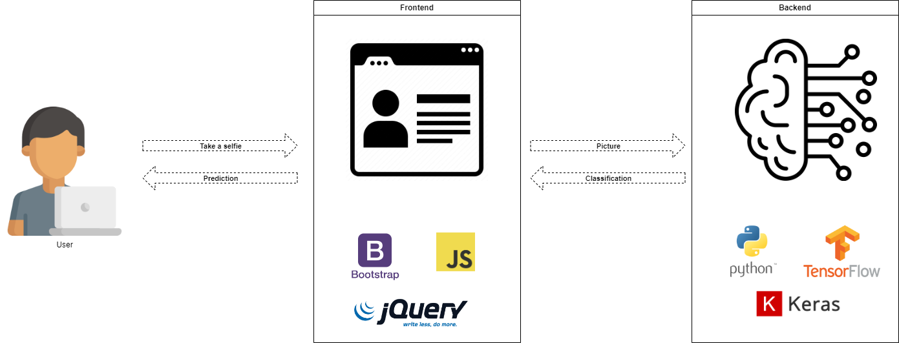

<!-- PROJECT LOGO -->

  

  <h1 align="center">FaceLens</h1>

  

    A Powerful Face Recognition Web Application
  

<!-- TABLE OF CONTENTS -->
## Table of Contents

- [About The Project](#about-the-project)
  - [High-Level Architecture](#high-level-architecture)
- [Key Features](#key-features)
- [Built With](#built-with)
- [Getting Started](#getting-started)
- [Usage](#usage)
- [Contributing](#contributing)
- [License](#license)

<!-- ABOUT THE PROJECT -->
## About The Project

FaceLens is a cutting-edge web application that leverages state-of-the-art neural approaches for precise and efficient face recognition. Designed with professionalism and accuracy in mind, it empowers users to perform facial recognition tasks effortlessly.

### High-Level Architecture

FaceLens comprises two primary components:

1. **User-Friendly Interface**: Our intuitive UI enables users to seamlessly capture photos using their webcams or upload images for analysis. Developed with Bootstrap, JavaScript, and JQuery, it ensures a smooth user experience.

2. **Advanced Backend**: The backend employs a sophisticated convolutional deep learning approach, implemented with TensorFlow and Keras in a Python environment, to process images from the UI. This ensures accurate and reliable face recognition results.

(<a href="#readme-top">back to top</a>)

## Key Features

FaceLens offers a wide range of features, including:

- **Real-Time Face Detection**: Instantly detect faces in live webcam streams.
- **Image Upload**: Analyze static images by uploading them to the application.
- **High Accuracy**: Utilizes neural networks for precise face recognition.
- **User-Friendly Interface**: An intuitive and responsive design for effortless use.
- **Open Source**: Collaborate and contribute to the project's development.
- **MIT License**: Use, modify, and distribute the application with ease.

(<a href="#readme-top">back to top</a>)

## Built With

FaceLens is built using the following technologies and libraries:

- [Python](#python)
- [JQuery](#jquery)
- [JavaScript](#javascript)
- [TensorFlow](#tensorflow)
- [Keras](#keras)
- [Bootstrap](#bootstrap)
- [Tensorflow.js](#tensorflowjs)

(<a href="#readme-top">back to top</a>)

<!-- GETTING STARTED -->
## Getting Started

To get started with FaceLens, follow these steps:

1. Clone the repository to your local machine.
2. Install the required dependencies by following the instructions in the project's documentation.
3. Run the application and start recognizing faces with ease.

For detailed installation and usage instructions, please refer to the [documentation](#documentation).

(<a href="#readme-top">back to top</a>)

<!-- USAGE -->
## Usage

FaceLens is versatile and can be used in various scenarios, including:

- Security Systems: Enhance access control with facial recognition.
- Photo Tagging: Automatically tag individuals in photos.
- Personal Projects: Use face recognition in your own applications.
- Education: Learn about deep learning and computer vision.
- Research: Explore the capabilities of neural networks in face analysis.

(<a href="#readme-top">back to top</a>)

<!-- CONTRIBUTING -->
## Contributing

We welcome contributions from the open-source community to make FaceLens even better. Here's how you can contribute:

1. Fork the Project
2. Create your Feature Branch (`git checkout -b feature/AmazingFeature`)
3. Commit your Changes (`git commit -m 'Add some AmazingFeature'`)
4. Push to the Branch (`git push origin feature/AmazingFeature`)
5. Open a Pull Request

Your contributions are greatly appreciated!

(<a href="#readme-top">back to top</a>)

<!-- LICENSE -->
## License

FaceLens is distributed under the MIT License. You are free to use, modify, and distribute this application for various purposes. See [`LICENSE.txt`](LICENSE.txt) for more information.

(<a href="#readme-top">back to top</a>)

